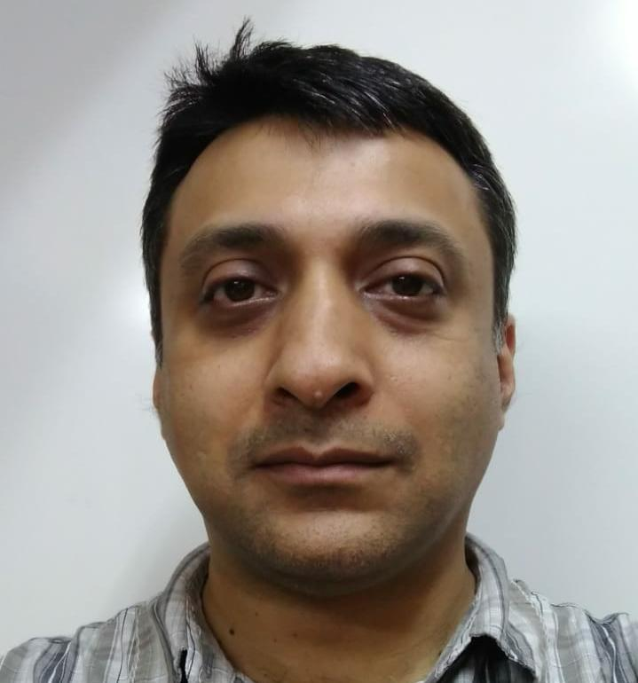

#### Antar Bandyopadhyay

Ph.D., University of California, Berkeley

_Areas of interest_: Mathematical probability, stochastic processes,
and application. Random graphs, probability on trees, recursive
distributional equations. Percolation, interacting particle systems,
random walks in random environment.

_E Mail_: antar [at] isid.ac.in

_Contact Information_: +91-11-41493932 , _Office Room No_: 208

* * *

#### Abhay G. Bhatt

Ph.D., Indian Statistical Institute, Delhi

_Areas of interest_: Markov Processes and martingale problems,
Stochastic Filtering Theory, Stochastic Control

_E Mail_: abhay [at] isid.ac.in

_Contact Information_: +91-4149-3927 , _Office Room No_: 203

* * *

#### Arindam Chatterjee

Ph.D., Iowa State University

_Areas of interest_: Network data, Statistics for high-dimensional data, Resampling methods, Time series.

_E Mail_: cha (at) isid.ac.in

_Contact Information_: +91-4149-3920 , _Office Room No_: 120

* * *

#### Isha Dewan

_Areas of interest_: Competing Risks, Reliabiliy Theory, Nonparamteric Inference

_E Mail_: isha (at) isid.ac.in

_Contact Information_: +91-11-4149-3944 , _Office Room No_: 220

* * *

#### Tanvi Jain

Ph.D., Indian Institute of Technology, Delhi

_Areas of interest_: Operator Theory - Matrix Analysis, Topology

_E Mail_: tanvi (at) isid.ac.in

_Contact Information_: +91-11-4149-3919 , _Office Room No_: 119

* * *

#### Shanta Laishram

Ph.D., Tata Institute of Fundamental Research, Mumbai

_Areas of interest_: Diophantine Equations, Binary Recurrence Sequences,  Irreducibility of Polynomials and Galois Groups, Arithmetic Dynamics,
Prime Numbers and the number theoretic aspects of Cryptography.

_E Mail_: shanta (at) isid.ac.in

_Contact Information_: +91-11-4149-3958 , _Office Room No_: 310

_Web Page_:[Shanta Laishram] (www.isid.ac.in/~shanta)

* * *

#### Swagata Nandi

Ph.D., Indian Institute of Technology, Kanpur

_Areas of interest_: Non Linear Regression, Statistical Signal Processing, Surrogate Data, Survival Analysis

_E Mail_: nandi (at) isid.ac.in

_Contact Information_: +91-11-41493931 , _Office Room No_: 207

* * *

#### Arup K. Pal

Ph.D., Indian Statistical Institute, Delhi

_Areas of interest_: Quantum groups, noncommutative geometry, operator algebras.

_E Mail_: arup [at] isid.ac.in

_Contact Information_: +91-11-4149-3921 , _Office Room No_: 121

* * *

#### Issan Patri

Ph.D., Institute of Mathematical Sciences, Chennai

_Areas of interest_: Operator Algebras, Quantum Groups, Mathematical Biology

_E Mail_: issanp (at) isid.ac.in

_Contact Information_: +91-11-4149-3940 , _Office Room No_: 216

* * *

#### Rahul Roy

Ph.D., Cornell University

_Areas of interest_: Probability theory, stochastic processes, particle systems and percolation theory, random graphs, history of mathematics.

_E Mail_: rahul [at] isid.ac.in

_Contact Information_: +91 11 41493905 (office), +91 11 41493981 (fax) , _Office Room No_: 105

* * *

#### Anish Sarkar

Ph.D., Indian Statistical Institute

_Areas of interest_: Particle systems and percolation theory, random graphs, extreme value theory

_E Mail_: anish.sarkar [at] gmail (dot) com, anish [at] isid (dot) ac (dot) in

_Contact Information_: +91-11-41493962 (Office Telephone) , _Office Room No_: 314

* * *

#### Deepayan Sarkar

Ph.D., University of Wisconsin-Madison

_Areas of interest_: Statistical Computing, Statistical Graphics, Computational Biology

_E Mail_: deepayan.sarkar (at) gmail.com, deepayan (at) isid.ac.in

_Contact Information_: +91-11-41493937 (Office) , _Office Room No_: 213

* * *

#### Soham Sarkar

Ph.D., Indian Statistical Institute, Kolkata

_Areas of interest_: High-dimensional Data, Functional Data, Statistical Learning

_E Mail_: sohamsarkar (at) isid.ac.in

_Contact Information_: +91-11-4149-3960 , _Office Room No_: 312 
